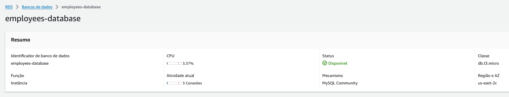
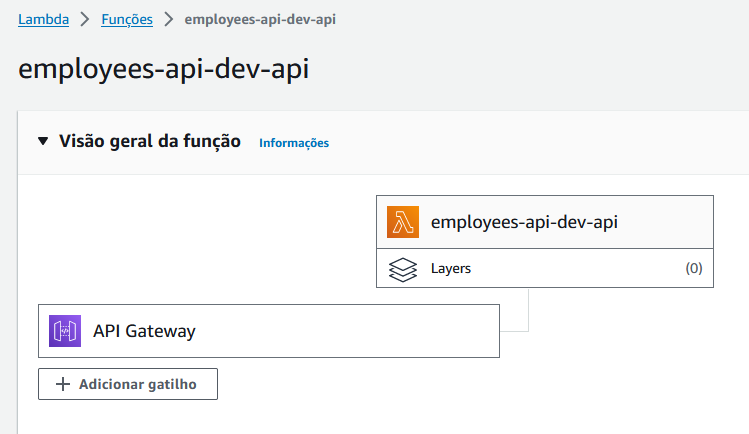

## Description
[Serverless Challenge](https://github.com/YvesJaques/serverless-challenge) Backend application developed with [NestJS](https://nestjs.com/) by [Caíque Garcia](https://www.linkedin.com/in/kiqgarcia/)

## Running locally
- Install dependencies
```bash
yarn install
```
- Create a SQL database named `employees-db`
- Run development server
```bash
# Application should start on `localhost:3001`
yarn dev
```

## Tests
- Run test suites
```bash
yarn test
```

## Deploy database instance

- [AWS CLI](https://aws.amazon.com/pt/cli/), [AWS Cloud​Formation](https://aws.amazon.com/pt/cloudformation/) and [Amazon Relational Database Service](https://aws.amazon.com/pt/rds/)
- Deployment configuration file `rds.yaml`
```bash
# Deploy with AWS CloudFormation
yarn deploy:db
```
- Create a database named `employees-db`

## Deploy application

- [Serverless Framework](https://www.serverless.com/), [AWS Lambda](https://aws.amazon.com/pt/pm/lambda/) and [Amazon API Gateway](https://aws.amazon.com/pt/api-gateway/)
- Deployment configuration file `serverless.yaml`
- Insert deployed database URL and credentials on `app.module.ts` file
```bash
# Modify app.module.ts file
host: 'insert-deployed-url-here'
```
- Run development server so the application could connect to database and create the `employee` table
```bash
# Application should start on `localhost:3001`
yarn dev
```
- Build application
```bash
# NestJS
yarn build
```
- Run deploy script
```bash
# Deploy with Serverless Framework
yarn deploy
```

## Clean-up
- Undo all the deployment stages to avoid unnecessary costs
```bash
# Delete Amazon Relational Database Service instance
yarn undeploy:db

# Delete AWS Lambda
yarn undeploy
```
